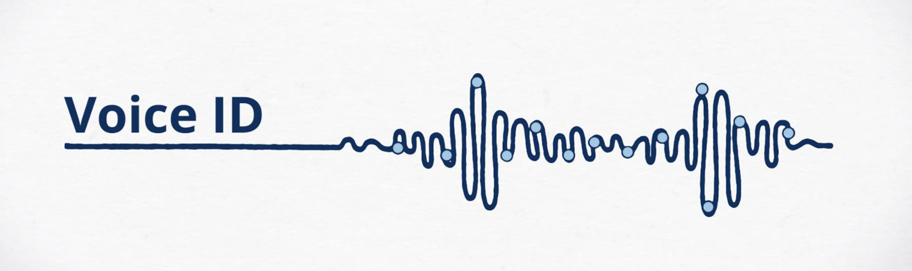
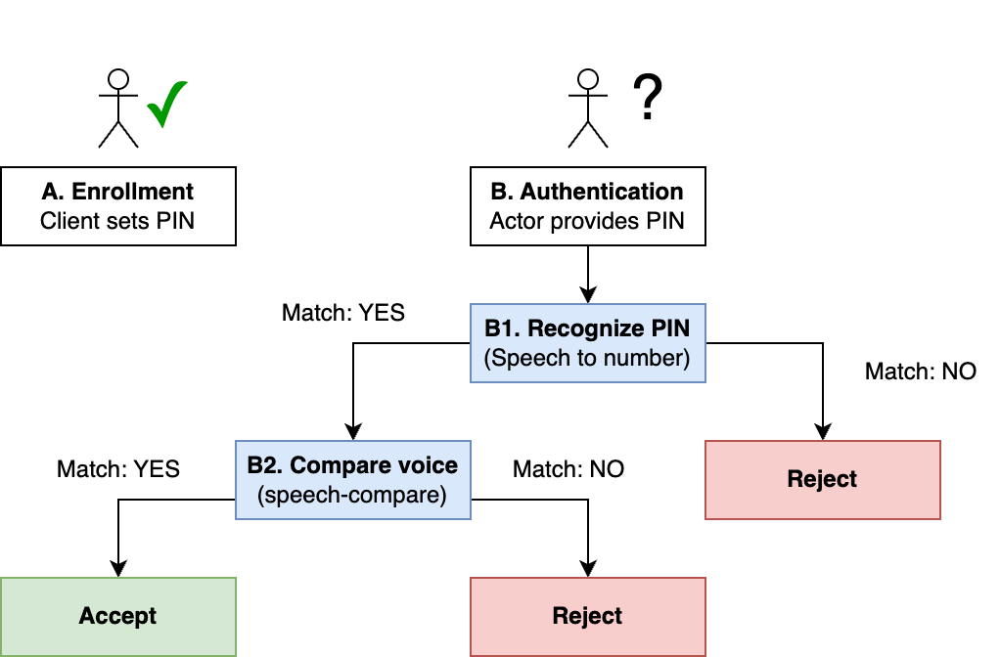
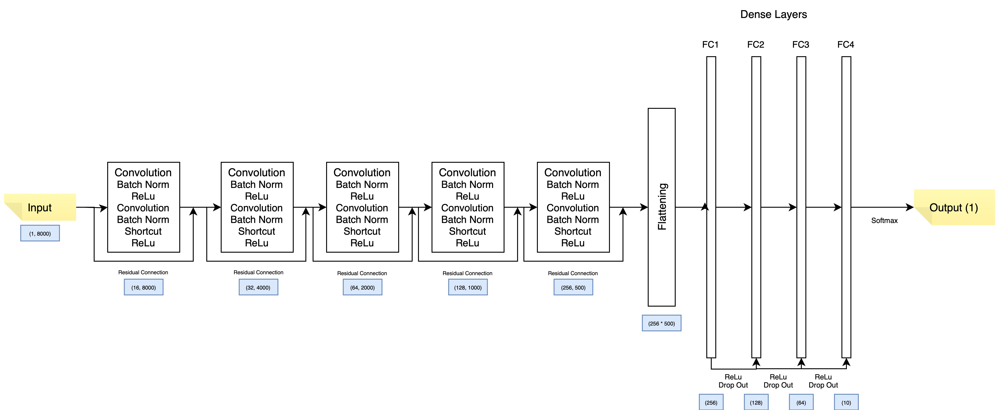
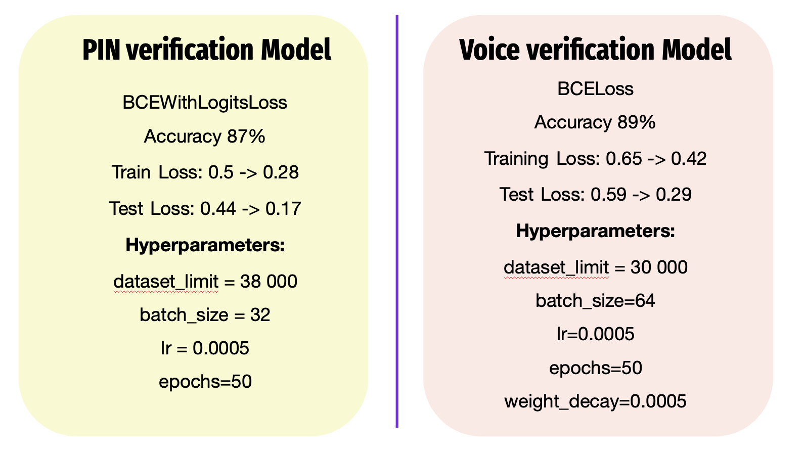

# Voice ID: Veryfying clients with voice

The project aims to develop a voice-based client verification system for a Revolut digital bank using machine learning to enhance security and authentication. The system verifies client PINs from speech and analyzes vocal patterns using a Convolutional Neural Network (CNN) trained on the Google Command speech dataset, achieving 86% accuracy. It processes audio recordings converted into waveforms to determine whether the voice belongs to a registered client.

## Business understanding

Voice authentication is becoming a highly secure method for user authentication, especially in digital banking, where it helps mitigate security breaches and fraud. By using the unique characteristics of a person’s voice, this technology provides a stronger layer of protection compared to traditional methods like passwords. For example, [HSBC UK saw a 50% reduction](https://www.about.hsbc.co.uk/news-and-media/hsbc-uks-voice-id-prevents-gbp249-million-of-attempted-fraud) in telephone fraud after implementing voice biometrics, demonstrating its effectiveness in reducing fraud and enhancing customer trust.

## Data understanding

The Speech Commands Dataset v0.02 consists of over 105,000 one-second .wav audio files, each containing a single spoken English word from a set of 35 unique commands. Organized into folders by word, the dataset includes recordings from various speakers and is available in the TensorFlow Datasets catalog. Additionally, it features background noise samples and labels like "silence" and "unknown" to improve noise handling.

## Data preprocessing 

In this project, we process audio data for client verification. The steps include converting WAV files into waveforms, resampling the audio to 8000 Hz, and transforming them into tensors of shape (1, 8000).  
The project uses two datasets:
* Dataset 1: Contains audio files and their corresponding labels (digits 0-9) for PIN verification.
* Dataset 2: Includes pairs of audio files (Audio1, Audio2) and labels (1/0) indicating whether the audios belong to the same user (1) or not (0) for user identity verification.

## Modeling
We chose a Convolutional Neural Network (CNN) for this voice verification project because of its ability to process and extract features directly from audio data. We chose PyTorch for building and training our Convolutional Neural Network (CNN) 

In this project the **target variable** is a binary label indicating whether the input voice belongs to a client or not:
* 1 (or True): If the input voice is verified as belonging to a client.
* 0 (or False): If the input voice does not belong to a client.

The system architecture for this voice-based client verification system consists of two main components:

**PIN Verification Module:** This module processes the client's spoken 4-digit PIN. A Convolutional Neural Network (CNN) analyzes the audio waveform of the pronounced PIN and compares it to the correct PIN. The output is a binary decision (correct or incorrect).
**Voice ID Verification Module:** If the PIN is correct, the system proceeds to verify the client's identity using their voice. Another CNN analyzes the client's voice features and compares them to the stored voice profile. The system outputs a binary decision (client or non-client) based on the match.

**PIN verification Model Architecture:**

**Voice verification Model Architecture:**

## Evaluation

Final models achieved accuracy of 87% for verifying PIN with voice and 89% for verifying clients id with voice. The loss is approaching 0 in both cases.

## Conclusions
With the growing adoption of voice biometrics worldwide, now is the ideal time for Revolut to embrace this technology and provide its customers with the most secure and convenient banking experience. Implementing voice authentication is a strategic move for Revolut, offering numerous advantages to clients, like advanced fraud precention and imporved acessibility.

### Next Steps and recommendations:
- **Create a Demo for System Flow:** Develop a working demo to showcase the entire system, from PIN verification to voice ID authentication.
- **Add More Training Data:** To enhance the model’s performance, gather additional training data, especially focusing on diverse client voices. This will improve the system's generalization and robustness in real-world scenarios.
- **Invest in Data Diversity:** Prioritize gathering diverse training data, including different accents and voice variations, to ensure the system is robust and inclusive for all clients.
- **Test System:** Conduct thorough testing of the system in different conditions to ensure it performs well across various scenarios. This includes testing with different accents, background noises, and varying voice qualities.
- **Implement the System:** After successful testing, deploy the system into the production environment.

## Repository Navigation

* Final Notebook - final_notebook.ipynb
* Slides - presentation.pdf
* Code for models, demo, FSM, requirments.txt - 'src' folder
* Digrams and visuals - 'images' folder
  
## Links

* [Final Notebook](final_notebook.ipynb) 
* [Presentation](presentation.pdf)
* [Models Checkpoints Saved](https://drive.google.com/drive/folders/1h-FudBMLzDU5_m823dHFsR2q8ZTrTBLl?usp=share_link)

## Reproduction instsructions

1. [Download Google command speech data set](https://storage.googleapis.com/download.tensorflow.org/data/speech_commands_v0.02.tar.gz)
2. Save all files into 'data_raw' folder, save folders with digits (0-10) into a 'data_numbers_wav' folder
3. Fork current repo
4. Clone repo to local folder
5. Create virtual environment: `python -m venv .venv`
6. Activate the virtual environment `.venv/bin/activate`
7. Install dependencies into the virtual environment: `pip install -r requirements.txt`
8. Use jupyter notebook to open 'final_notebook'
